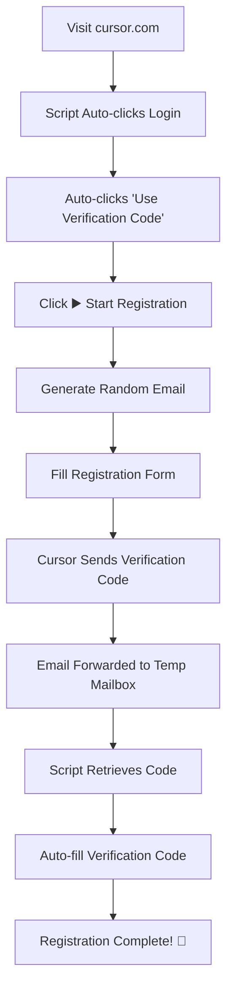

# Cursor Auto Registration Assistant

**Language / 语言**: [English](#english) | [中文](#中文)

## Table of Contents / 目录

### English
- [Features](#-features)
- [Installation](#-installation)
- [Configuration](#️-configuration)
- [How It Works](#-how-it-works)
- [Usage](#-usage)
- [Troubleshooting](#️-troubleshooting)
- [Privacy & Security](#-privacy--security)

### 中文
- [功能特性](#-功能特性)
- [安装方法](#-安装方法)
- [配置说明](#️-配置说明)
- [工作原理](#-工作原理)
- [使用方法](#-使用方法)
- [故障排除](#️-故障排除)
- [隐私与安全](#-隐私与安全)

---

## English

**🔗 Quick Navigation**: [🇺🇸 English](#english) | [🇨🇳 中文](#中文) | [⬆️ Top](#cursor-auto-registration-assistant)

🚀 **Modern Cursor auto-registration assistant with streamlined UI and enhanced functionality.**

Automatically handles the complete registration workflow: generates random emails using your domain, retrieves verification codes from temporary mailbox via tempmail.plus API, supports spaced verification codes, and includes smart retry mechanisms. Perfect for Cloudflare email forwarding setups.

## ✨ Features

- 🎯 **Fully Automated Registration** - Complete hands-free Cursor account creation
- 📧 **Smart Email Generation** - Creates random emails using your custom domain
- 🔄 **Auto Verification Code Retrieval** - Fetches codes from temporary mailbox
- 🌐 **Cloudflare Email Forwarding Support** - Seamless integration with email forwarding
- 🎨 **Modern UI** - Beautiful gradient interface with real-time logging
- 🔒 **CSP Compliant** - Works with strict Content Security Policies
- 🔁 **Smart Retry Mechanism** - Automatic retry with configurable intervals
- 📱 **Responsive Design** - Works on all screen sizes
- 🛡️ **Privacy Focused** - All configurations stored locally

## 📦 Installation

### Prerequisites
- [Tampermonkey](https://www.tampermonkey.net/) browser extension
- A temporary email service account (tempmail.plus recommended)
- Optional: Custom domain with email forwarding (Cloudflare recommended)

### Steps
1. Install Tampermonkey extension in your browser
2. Copy the script content from `cursor_register.js`
3. Create a new userscript in Tampermonkey
4. Paste the script content and save
5. Navigate to [cursor.com](https://cursor.com) to see the assistant panel

## ⚙️ Configuration

Click the ⚙️ gear icon in the assistant panel to configure:

### Required Settings

| Setting | Description | Example |
|---------|-------------|---------|
| **Temporary Email Address** | Complete temporary email for receiving verification codes | `abc123@mailto.plus` |
| **Email PIN Code** | PIN code for temporary email access (if required) | `your-pin-code` |
| **Registration Email Domain** | Your domain for generating registration emails | `yourdomain.com` |

### Email Forwarding Setup (Recommended)

For best results, set up email forwarding:

1. **Cloudflare Email Routing** (Free):
   ```
   Source: *@yourdomain.com
   Destination: abc123@mailto.plus
   ```

2. **Alternative Services**:
   - Google Workspace
   - Microsoft 365
   - Custom mail server

## 🔄 How It Works

### Registration Flow


### Email Generation Example
```
Domain: yourdomain.com
Generated: emily789xyz456@yourdomain.com
Forwarded to: abc123@mailto.plus
```

## 🎮 Usage

### Quick Start
1. **Configure the script** - Click ⚙️ and enter your settings
2. **Visit Cursor** - Go to [cursor.com](https://cursor.com)
3. **Start Registration** - Click the ▶️ button when ready
4. **Watch the Magic** - The script handles everything automatically

### Manual Steps (if needed)
- **Email Page**: Click ▶️ to auto-fill email
- **Verification Page**: Click ▶️ to auto-retrieve and fill code
- **Any Issues**: Check the real-time logs in the panel

## 📊 Supported Verification Code Formats

The script intelligently handles various verification code formats:

- ✅ **Continuous digits**: `123456`
- ✅ **Spaced digits**: `1 2 3 4 5 6`
- ✅ **Common patterns**: 
  - "Your code is: 123456"
  - "Verification code: 123456"
  - "One-time code is: 123456"

## 🛠️ Troubleshooting

### Common Issues

| Issue | Solution |
|-------|----------|
| **Panel not showing** | Refresh page, check if script is enabled |
| **Configuration not saving** | Ensure Tampermonkey has storage permissions |
| **No verification code** | Check email forwarding setup and temp mailbox |
| **Code extraction fails** | Verify temp email PIN code is correct |
| **CSP errors** | Use the modern version (cursor_register.js) |

### Debug Mode
Enable detailed logging by checking the console panel. The script provides comprehensive logs for each step.

## 🔧 Advanced Configuration

### Retry Settings
```javascript
const CONFIG = {
    maxRetries: 10,        // Maximum retry attempts
    retryInterval: 3000    // Wait time between retries (ms)
};
```

### Custom Name Lists
Modify the name arrays for different email generation patterns:
```javascript
const NAMES = {
    first: ['alex', 'emily', 'jason', ...],
    last: ['taylor', 'anderson', 'thompson', ...]
};
```

## 🔒 Privacy & Security

- ✅ **Local Storage Only** - All configurations stored locally in Tampermonkey
- ✅ **No Data Collection** - Script doesn't send data to external servers
- ✅ **Open Source** - Full code transparency
- ✅ **Temporary Emails** - Protects your real email address
- ✅ **Auto Cleanup** - Emails are deleted after code retrieval

## 📋 Version Comparison

| Feature | Enhanced v2.1 | Modern v3.0 |
|---------|---------------|-------------|
| **CSP Compliance** | ✅ | ✅ |
| **UI Design** | Traditional | Modern Gradient |
| **Code Length** | 1014 lines | 635 lines |
| **Configuration** | Split fields | Unified email |
| **Error Handling** | Basic | Enhanced |
| **Verification Codes** | Standard | Enhanced patterns |

## 🤝 Contributing

Contributions are welcome! Please feel free to submit issues and enhancement requests.

## 📄 License

MIT License - feel free to modify and distribute.

## ⚠️ Disclaimer

This tool is for educational and automation purposes. Please ensure compliance with Cursor's Terms of Service and use responsibly.

---

## 中文

**🔗 快速导航**: [🇺🇸 English](#english) | [🇨🇳 中文](#中文) | [⬆️ 返回顶部](#cursor-auto-registration-assistant)

🚀 **现代化的Cursor自动注册助手，具有简洁的UI和增强功能。**

自动处理完整的注册工作流程：使用您的域名生成随机邮箱，通过tempmail.plus API从临时邮箱获取验证码，支持带空格的验证码，并包含智能重试机制。完美支持Cloudflare邮箱转发设置。

### ✨ 功能特性

- 🎯 **全自动注册** - 完全免手动的Cursor账户创建
- 📧 **智能邮箱生成** - 使用您的自定义域名创建随机邮箱
- 🔄 **自动验证码获取** - 从临时邮箱自动获取验证码
- 🌐 **Cloudflare邮箱转发支持** - 与邮箱转发无缝集成
- 🎨 **现代化UI** - 美观的渐变界面和实时日志
- 🔒 **CSP兼容** - 适用于严格的内容安全策略
- 🔁 **智能重试机制** - 可配置间隔的自动重试
- 📱 **响应式设计** - 适配所有屏幕尺寸
- 🛡️ **隐私保护** - 所有配置本地存储

### 📦 安装方法

#### 前置要求
- [Tampermonkey](https://www.tampermonkey.net/) 浏览器扩展
- 临时邮箱服务账户（推荐tempmail.plus）
- 可选：带邮箱转发的自定义域名（推荐Cloudflare）

#### 安装步骤
1. 在浏览器中安装Tampermonkey扩展
2. 复制`cursor_register.js`脚本内容
3. 在Tampermonkey中创建新的用户脚本
4. 粘贴脚本内容并保存
5. 访问[cursor.com](https://cursor.com)查看助手面板

### ⚙️ 配置说明

点击助手面板中的⚙️齿轮图标进行配置：

#### 必需设置

| 设置项 | 说明 | 示例 |
|--------|------|------|
| **临时邮箱地址** | 用于接收验证码的完整临时邮箱 | `abc123@mailto.plus` |
| **邮箱PIN码** | 临时邮箱访问PIN码（如需要） | `your-pin-code` |
| **注册邮箱域名** | 用于生成注册邮箱的域名 | `yourdomain.com` |

#### 邮箱转发设置（推荐）

为获得最佳效果，请设置邮箱转发：

1. **Cloudflare邮箱路由**（免费）：
   ```
   源地址: *@yourdomain.com
   目标地址: abc123@mailto.plus
   ```

2. **其他服务**：
   - Google Workspace
   - Microsoft 365
   - 自定义邮件服务器

### 🔄 工作原理

#### 注册流程
```
访问cursor.com → 脚本自动点击登录 → 自动点击"使用验证码登录"
→ 点击▶️开始注册 → 生成随机邮箱 → 填写注册表单
→ Cursor发送验证码 → 邮箱转发到临时邮箱 → 脚本获取验证码
→ 自动填写验证码 → 注册完成！🎉
```

#### 邮箱生成示例
```
域名: yourdomain.com
生成: emily789xyz456@yourdomain.com
转发到: abc123@mailto.plus
```

### 🎮 使用方法

#### 快速开始
1. **配置脚本** - 点击⚙️输入您的设置
2. **访问Cursor** - 前往[cursor.com](https://cursor.com)
3. **开始注册** - 准备好后点击▶️按钮
4. **观看魔法** - 脚本自动处理一切

#### 手动步骤（如需要）
- **邮箱页面**：点击▶️自动填写邮箱
- **验证页面**：点击▶️自动获取并填写验证码
- **遇到问题**：查看面板中的实时日志

### 📊 支持的验证码格式

脚本智能处理各种验证码格式：

- ✅ **连续数字**：`123456`
- ✅ **带空格数字**：`1 2 3 4 5 6`
- ✅ **常见模式**：
  - "您的验证码是：123456"
  - "验证码：123456"
  - "一次性验证码：123456"

### 🛠️ 故障排除

#### 常见问题

| 问题 | 解决方案 |
|------|----------|
| **面板未显示** | 刷新页面，检查脚本是否启用 |
| **配置未保存** | 确保Tampermonkey有存储权限 |
| **未收到验证码** | 检查邮箱转发设置和临时邮箱 |
| **验证码提取失败** | 验证临时邮箱PIN码是否正确 |
| **CSP错误** | 使用现代版本（cursor_register.js） |

### 🔒 隐私与安全

- ✅ **仅本地存储** - 所有配置存储在Tampermonkey本地
- ✅ **无数据收集** - 脚本不向外部服务器发送数据
- ✅ **开源透明** - 代码完全透明
- ✅ **临时邮箱** - 保护您的真实邮箱地址
- ✅ **自动清理** - 验证码获取后自动删除邮件

### 📋 版本对比

| 功能 | Enhanced v2.1 | Modern v3.0 |
|------|---------------|-------------|
| **CSP兼容** | ✅ | ✅ |
| **UI设计** | 传统样式 | 现代渐变 |
| **代码长度** | 1014行 | 635行 |
| **配置方式** | 分离字段 | 统一邮箱 |
| **错误处理** | 基础 | 增强 |
| **验证码识别** | 标准 | 增强模式 |

### 🤝 贡献

欢迎贡献！请随时提交问题和功能请求。

### 📄 许可证

MIT许可证 - 可自由修改和分发。

### ⚠️ 免责声明

此工具仅用于教育和自动化目的。请确保遵守Cursor的服务条款并负责任地使用。

---

**Made with ❤️ for the developer community**
